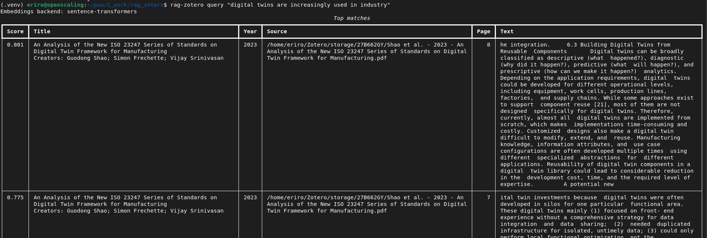

# rag_zotero

Index academic PDFs (typically stored in Zotero’s local `storage/`) into a local vector DB and query them using embeddings.

Example:


## Quickstart

### 1) Create a venv + install

```bash
python -m venv .venv
source .venv/bin/activate
python -m pip install -U pip
python -m pip install git+https://github.com/jkCXf9X4/rag_zotero
```

### 2) Configure

Place the .env file in the directory that you are using to query the database

Copy `.env.example` to `.env` and optionally set `OPENAI_API_KEY` (leave blank for local embeddings).

`rag-zotero` loads `.env` from your current working directory. If you want to keep an env file elsewhere, set `RAG_ZOTERO_ENV_FILE=/path/to/.env`. By default, variables already set in your shell take precedence over `.env`; set `RAG_ZOTERO_DOTENV_OVERRIDE=1` to force `.env` to override.

### 3) Index your Zotero PDFs

Point at your Zotero `storage/` directory (example paths):
- Linux: `~/Zotero/storage`
- macOS: `~/Zotero/storage`
- Windows: `%USERPROFILE%\\Zotero\\storage`

```bash
rag-zotero index --storage-dir "$HOME/Zotero/storage"
```

#### Optional: enrich results with Zotero metadata (recommended)

Export your library from Zotero as JSON (either Zotero JSON or Better BibTeX JSON), then pass it in:

```bash
rag-zotero index --storage-dir "$HOME/Zotero/storage" --export-json "$HOME/Zotero/lib-export.json"
```

This will store metadata like `title`, `creators`, `year`, `doi`, and `citekey` (if present) alongside each chunk and show it in `query`.

### 4) Query

```bash
rag-zotero query "What is temporal independence in co-simulation?"
```

## Commands

- `rag-zotero doctor`: show config, verify dependencies (use `--live` to do an actual embedding call).
- `rag-zotero scan --storage-dir ...`: list candidate files.
- `rag-zotero index --storage-dir ...`: extract + chunk + embed + store.
- `rag-zotero query "...":` semantic search against the index.

## Codex CLI skill (optional)

To let Codex CLI call the search commands as a skill (scan/query), install the bundled skill into your Codex home:

```bash
rm -rf ~/.codex/skills/rag-zotero && mkdir -p ~/.codex/skills/rag-zotero && cp -r codex_skills/rag-zotero/* ~/.codex/skills/rag-zotero/  && chmod +x ~/.codex/skills/rag-zotero/scripts/*.sh
```

Restart Codex CLI (or start a new session). You can then ask for `$rag-zotero` to run `scan` / `query` and return JSON using `--json`.

## Notes / limitations

- PDFs that are image-only (no text layer) will extract poorly; OCR can be added later.


To install local
```bash
python -m pip install -e .
```